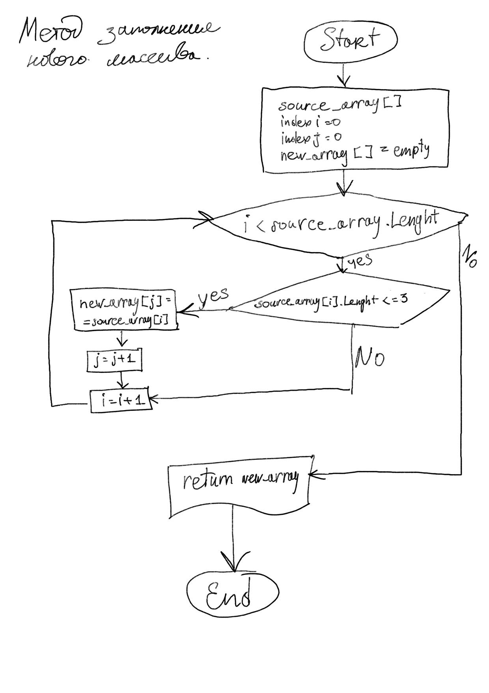

# Задача: 

Написать программу, которая из имеющегося массива строк формирует новый массив из строк, длина которых меньше, либо равна 3 символам. Первоначальный массив можно ввести с клавиатуры, либо задать на старте выполнения алгоритма. При решении не рекомендуется пользоваться коллекциями, лучше обойтись исключительно массивами.

## Для решения задачи производим следующие действия:

1. Запрашиваем размер массива от пользователя.
2. Создаем исходный пустой массив строк размером введенным выше.
3. Определяем размер будущего массива по умолчанию - ноль.
4. Реализовываем метод заполнения исходного массива с помощью цикла _**for**_:
    * Запрашиваем ввод строк от пользователя.
    * Если строка пустая, то запрашиваем снова до тех пор, пока пользователь не введет минимум один символ.
    * Если введенное значение меньше или равно трем символам, то значит это будущий элемент нового массива, следовательно увеличиваем его размер на единицу.
5. Создаем новый массив с уже определенным размером соответствующим только размеру необходимых элементов.
6. Реализовываем метод заполнения нового массива:
    * Проходим по исходному массиву циклом _**for**_.
    * Если размер элемента меньше или равен трем символам, то добавляем его в новый массив.
7. Выводим новый массив на экран.

## Блок-схема

Метод заполнения нового массива:
